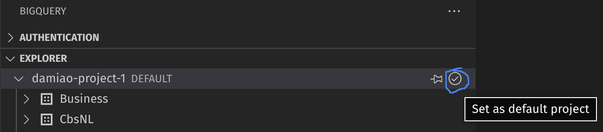
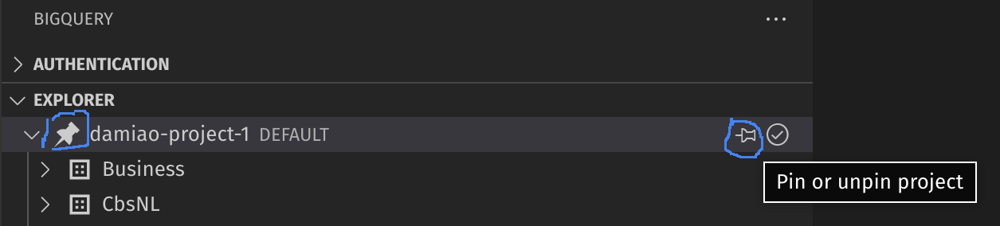
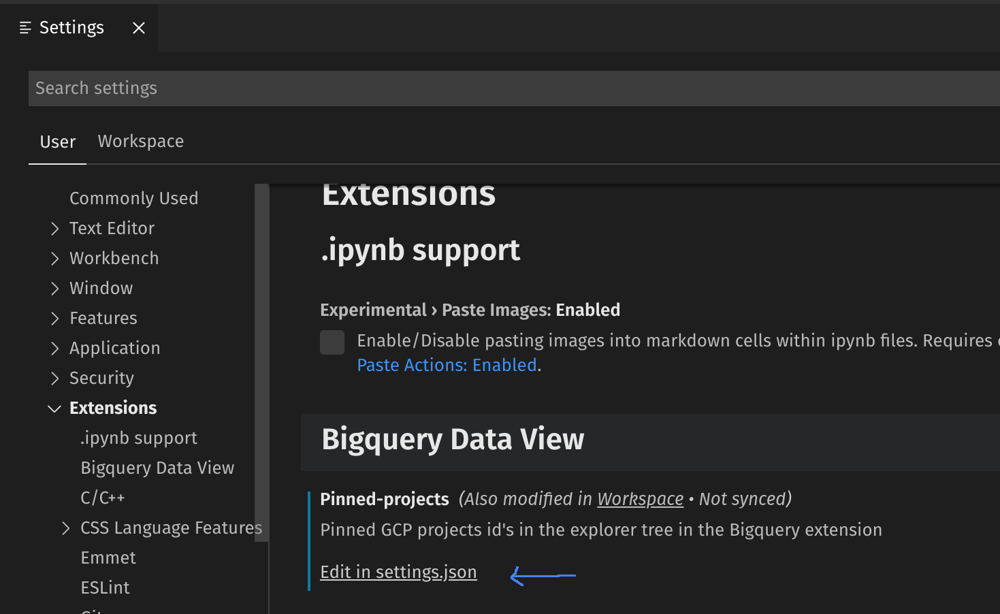
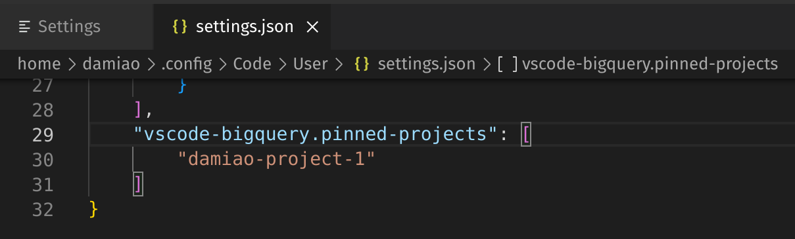
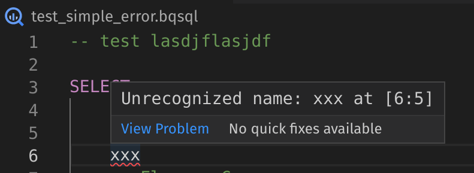
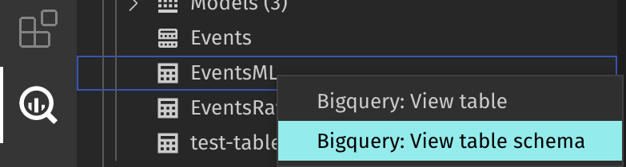
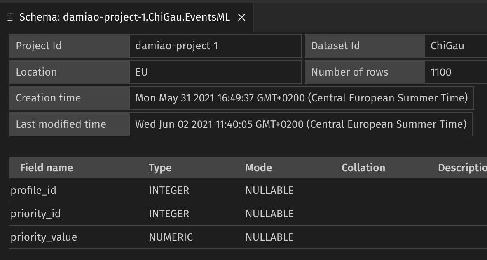

# Bigquery extension for Visual Studio Code
This extension aims to bring most of the functionality of Bigquery to Visual Studio Code. At the moment is possible to: authenticate ( using the [gcloud CLI](https://cloud.google.com/sdk/docs/install)); list projects, dataset and tables; view table content; and run queries.

## Authentication
The authentication is taken cared by the [gcloud CLI](https://cloud.google.com/sdk/docs/install). Threfore, gcloud CLI must be installed. This extension makes a visual representation of what is provided by that console application.

The three buttons "User login", "User login + GDrive" and "Service account" reflect that three possible ways of authenticate the requests. Either user personal authentication is used, where the computer browser will be opened requesting authentication to Google Cloud for the options "User login" and "User login + GDrive". Use the "GDrive" option to be able to browse and select tables based on Google Drive. Or, a service account key file (json format) must be selected when requested by pressing the button "Service account".

When there's a valid account active and with the necessary permissions to interact with bigquery, this extension is ready to be used.

Additional functionality to activate and revoke authentication accounts is also provided.

This screen is refreshed programatically every time that a change is detected. Additionaly, to refresh the authentication screen, can be done my executing the command `Bigquery: Authentication refresh`.

## Projects, Dataset and Tables tree
In the Bigquery side panel, sub panel "explorer", a tree of projects, datasets, tables, views, functions and ML models is available. Compared with tree available in the Bigquery interface in the Google Cloud portal, the "saved queries" are missing. Other than that, it should be like-for-like. 

To refresh the explorer screen, can be done my executing the command `Bigquery: Explorer refresh`.

Is possible to change the default project that queries will run against.

In order to influence the order of the different GCP projects on the list, is possible to pin one or more to stay on top of the list.

By using the command show in the image above, the local settings will be changed. 

To make changes at <b>user level</b>, the settings must be modified via the settings menu and change the associated file.

Interaction with views, functions and ML models is still not implemented. Will be available in future releases of this extension. At the moment, only tables have `View Table` and `View Schema` functionality. This is accessible by right-click on the table name on that tree. A single click on the table item open a visualization of the content of the selected table (`View Table` command).

## Run queries
This extension responds to files with extension `.bqsql`. The querie(s) in the editor can be run using the key `Ctrl+Enter` ( same as in the Google Cloud portal ), executing the command `Biguery: Run Query` or pressing the dedicated button in the file editor.

To run only the query selected in the text, can be done by the key combination `Ctrl+E`, using the command `Biguery: Run Selected Query` or pressing the dedicated button in the editor window. ()

After the query returns a response, the bottom panel of Visual Studio code will be made visible with the selected tab `Bigquery: Query results`. There, the query results are displayed with the usual pagination functionality. For convinience, is possible to open the same query results in another tab for side-by-side comparisons or further persistance. The results in the bottom panel will only represent the latest query execution.

As visible in the image above, syntax highlight is very poor at the moment. Intellisence is not implemented at all. This will be the next improvements biggest area. 

The query in the editor is evaluated in every change. If there's errors in the query, it will be underlined

If the query is valid, the number of bytes that will be consumed will appear in the bottom bar

## View table schema

When exploring the tree of projects, dataset and its contents, the table items have the possibility of opening a schema page in the context menu (right-click). `Bigquery: View table schema` 

This command will open a page containg some information about the table and it's schema.

<!-- ### Known Issues -->

### Troubleshooting
Sometimes, after this extension is installed, the command `Bigquery: Run query` is not able to force open the bottom panel to display the results. Please restart Visual Studio Code when that happens.

<!-- ### Generate a bug report -->

## Project board
Available in github: https://github.com/orgs/bstruct/projects/1/views/2.

## Report a bug
Please file an issue most descriptive as possible in https://github.com/bstruct/vscode-bigquery/issues.
