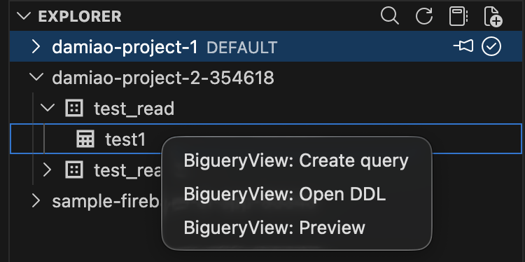
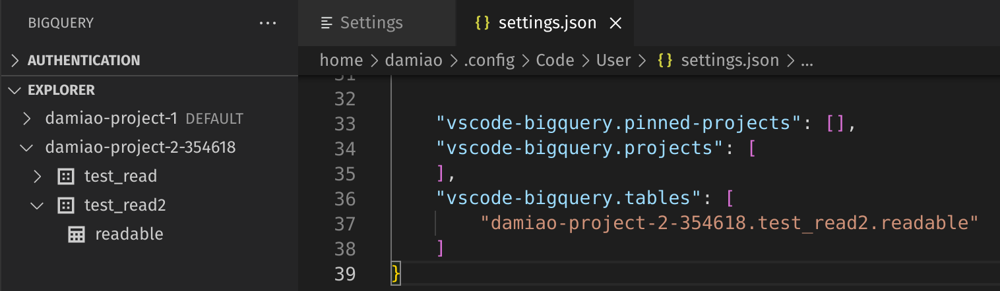

# Bigquery extension for Visual Studio Code
This extension aims to bring most of the functionality of Bigquery to Visual Studio Code. At the moment is possible to: authenticate ( using the [gcloud CLI](https://cloud.google.com/sdk/docs/install)); list projects, dataset, and tables; view table content; and run queries.

## Authentication
The authentication is taken care of by the [gcloud CLI](https://cloud.google.com/sdk/docs/install). Therefore, gcloud CLI must be installed. This extension makes a visual representation of what is provided by that console application.

The three buttons "User login", "User login + GDrive" and "Service account" reflect the three possible ways of authenticating the requests. Either user personal authentication is used, where the computer browser will be opened requesting authentication to Google Cloud for the options "User login" and "User login + GDrive". Use the "GDrive" option to be able to browse and select tables based on Google Drive. Or, a service account key file (json format) must be selected when requested by pressing the button "Service account".

When there's a valid account active and with the necessary permissions to interact with bigquery, this extension is ready to be used.

Additional functionality to activate and revoke authentication accounts is also provided.

This screen is refreshed programmatically every time a change is detected. Additionally, refreshing the authentication screen can be done my executing the command `Bigquery: Authentication refresh`.

## Projects, Dataset, and Tables tree
In the Bigquery side panel, sub panel "explorer", a tree of projects, datasets, tables, views, functions, and ML models are available. Compared with the tree available in the Bigquery interface in the Google Cloud portal, the "saved queries" are missing. Other than that, it should be like-for-like. 

Refresh the explorer screen, which can be done by executing the command `Bigquery: Explorer refresh`.

Is possible to change the default project that queries will run against.

## Views, tables, and schemas

For `views` and `tables` is possible to access the menu via right-click.

- Create query: opens a new query editor with a basic SELECT FROM statement.
- Preview: That opens a window with the table representation of the table. For external tables and views, a `SELECT *` statement will be run internally in order to show the results of the table.

- View schema: Opens a window that describes the meta information of the table or views

## Settings

There are three different settings possible to configure.
- Pin a project
- Add GCP projects to the list (when there's no full access to the project)
- Add Bigquery tables to the list (when there's no full access to the dataset)

To make changes at <b>user level</b>, meaning, that can be synced between computers under the same login, the settings must be modified via the settings menu and change the associated file.

 
 

### Pin a project

In order to influence the order of the different GCP projects on the list, is possible to pin one or more to stay on top of the list.

By using the command shown in the image above, the local settings will be changed. 

### Add GCP projects
For the cases where the user only has read permissions into Bigquery at dataset level, the normal list of projects will not detect the correspondent project. In this case, is possible to force a project to be listed and consequentially the dataset will also be listed.

### Add Bigquery tables
When permission is given to a table, not a correspondent dataset or project, is possible to configure table IDs to assure that they are listed and can benefit from the usual functionality.

## Run queries
This extension responds to files with the extension `.bqsql`. The querie(s) in the editor can be run using the key `Ctrl+Enter` ( same as in the Google Cloud portal ), executing the command `Biguery: Run Query` or pressing the dedicated button in the file editor.

To run only the query selected in the text can be done by the key combination `Ctrl+E`, using the command `Biguery: Run Selected Query` or pressing the dedicated button in the editor window. ()

After the query returns a response, the bottom panel of Visual Studio code will be made visible with the selected tab `Bigquery: Query results`. There, the query results are displayed with the usual pagination functionality. For convenience, is possible to open the same query results in another tab for side-by-side comparisons or further persistence. The results in the bottom panel will only represent the latest query execution.

As visible in the image above, syntax highlight is very poor at the moment. Intellisence has too few features. This will be the next improvement's biggest area. 

The query in the editor is evaluated with every change. If there are errors in the query, they will be underlined

If the query is valid, the number of bytes that will be consumed will appear in the bottom bar

## Download CSV

After a query has run, in the result grid, there's the option of downloading the same results in CSV format. The file generated supports multiline but not nested complex objects. 
There is no limit size/row number imposed in this feature, so please be aware of the effort that will be asked of your computer.

<!-- ### Known Issues -->

### Troubleshooting
Sometimes, after this extension is installed, the command `Bigquery: Run query` is not able to force open the bottom panel to display the results. Please restart Visual Studio Code when that happens.

<!-- ### Generate a bug report -->

## Project board
Available in github: https://github.com/orgs/bstruct/projects/1/views/2.

## Report a bug
Please file an issue most descriptive as possible at https://github.com/bstruct/vscode-bigquery/issues.
