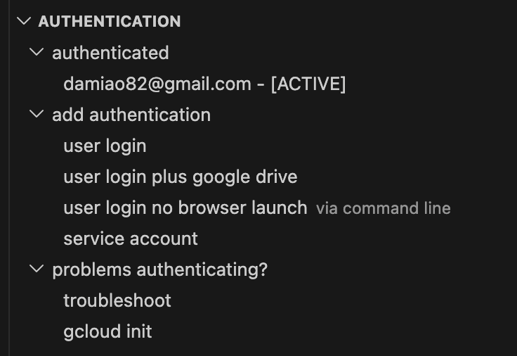
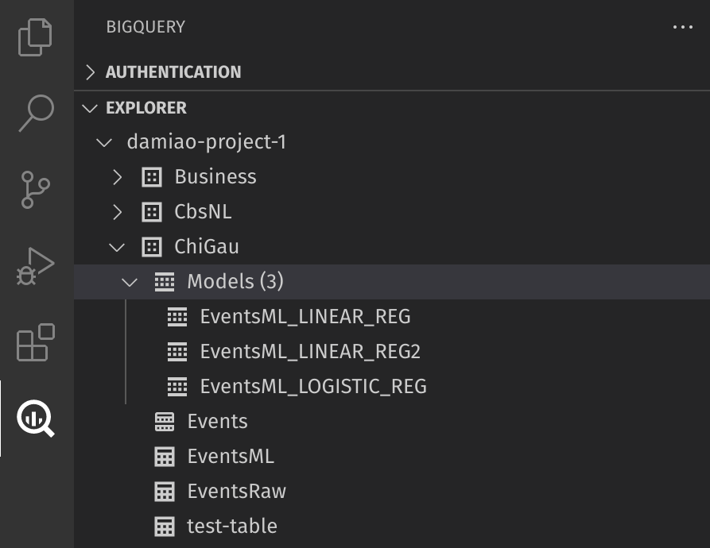
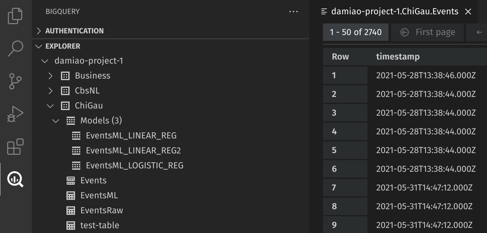

# Bigquery extension for Visual Studio Code
This extension aims to bring most of the functionality of Bigquery to Visual Studio Code. At the moment is possible to: authenticate ( using the [gcloud CLI](https://cloud.google.com/sdk/docs/install)); list projects, dataset and tables; view table content; and run queries.

## Authentication
The authentication is taken cared by the [gcloud CLI](https://cloud.google.com/sdk/docs/install). Threfore, gcloud CLI must be installed. This extension makes a visual representation of what is provided by that console application.

The two buttons "User login" and "Service account" reflect that two possible ways of authenticate the requests. Either user personal authentication is used, where the computer browser will be opened requesting authentication to Google Cloud. Or, a service account key file (json format) must be selected when requested by pressing the button "Service account".

When there's a valid account active and with the necessary permissions to interact with bigquery, this extension is ready to be used.

Additional functionality to activate and revoke authentication accounts is also provided.

This screen is refreshed programatically every time that a change is detected. Additionaly, to refresh the authentication screen, can be done my executing the command `Bigquery: Authentication refresh`.

## Projects, Dataset and Tables tree
In the Bigquery side panel, sub panel "explorer", a tree of projects, datasets, tables, views, functions and ML models is available. Compared with tree available in the Bigquery interface in the Google Cloud portal, the "saved queries" are missing. Other than that, it should be like-for-like. 

To refresh the explorer screen, can be done my executing the command `Bigquery: Explorer refresh`.

Interaction with views, functions and ML models is still not implemented. Will be available in future releases of this extension. At the moment, only tables have `View Table` functionality. This is accessible by right-click on the table name on that tree, or a single click. Any of these actions will open a visualization of the content of the selected table.

## Run queries

This extension responds to files with extension `.bqsql`. The querie(s) in the editor can be run using the key `Ctrl+Enter` ( same as in the Google Cloud portal ), executing the command `Biguery: Run Query` or pressing the dedicated button in the file editor.

After the query returns a response, the bottom panel of Visual Studio code will be made visible with the selected tab `Bigquery: Query results`. There, the query results are displayed with the usual pagination functionality. For convinience, is possible to open the same query results in another tab for side-by-side comparisons or further persistance. The results in the bottom panel will only represent the latest query execution.

<!-- ### Known Issues -->

<!-- ### Troubleshooting -->

<!-- ### Generate a bug report -->

### Project board
Available in github: https://github.com/orgs/bstruct/projects/1/views/2.

### Report a bug

Please file an issue most descriptive as possible in https://github.com/bstruct/vscode-bigquery/issues.
