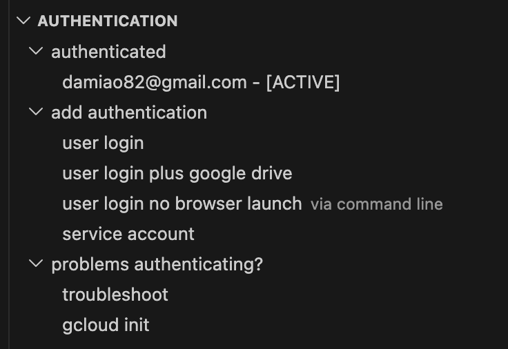
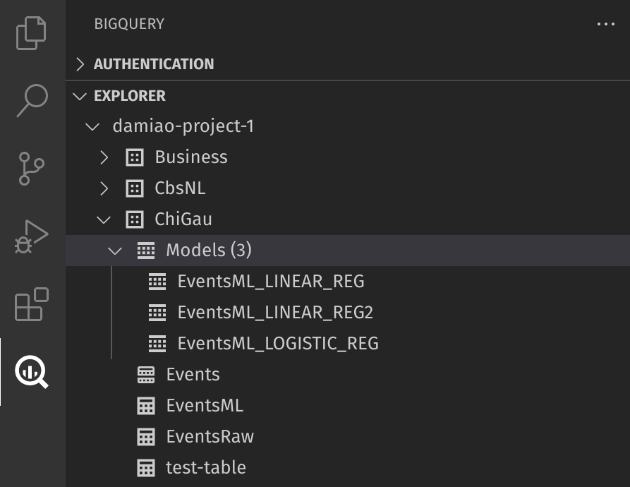
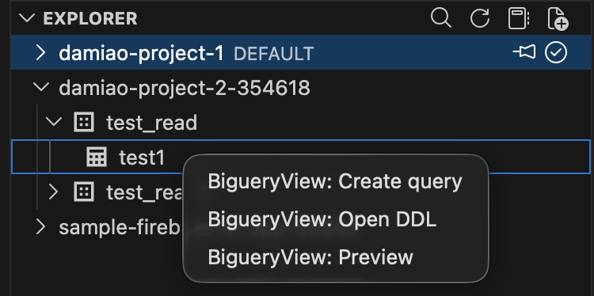
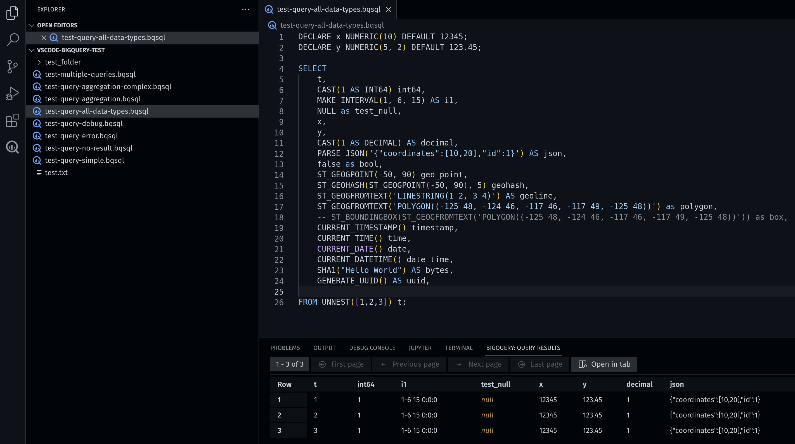
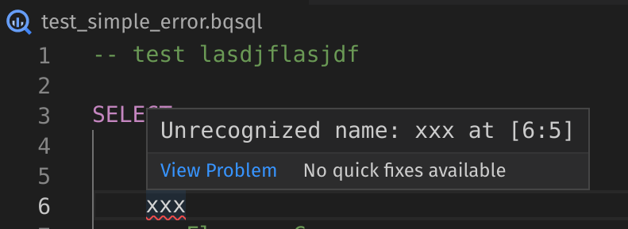
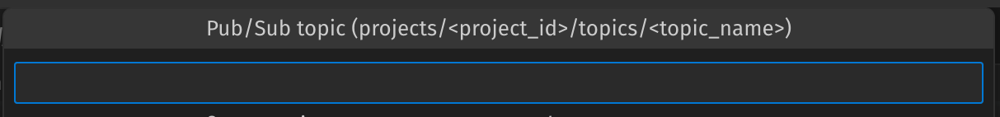
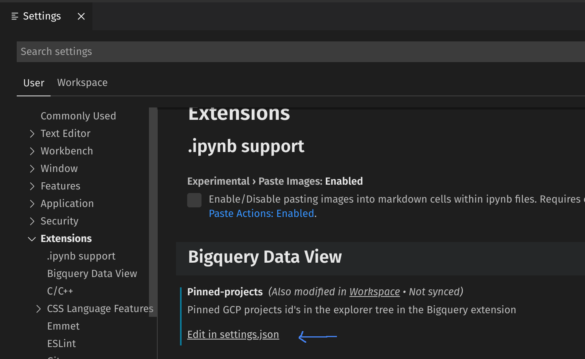
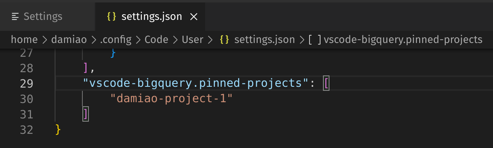
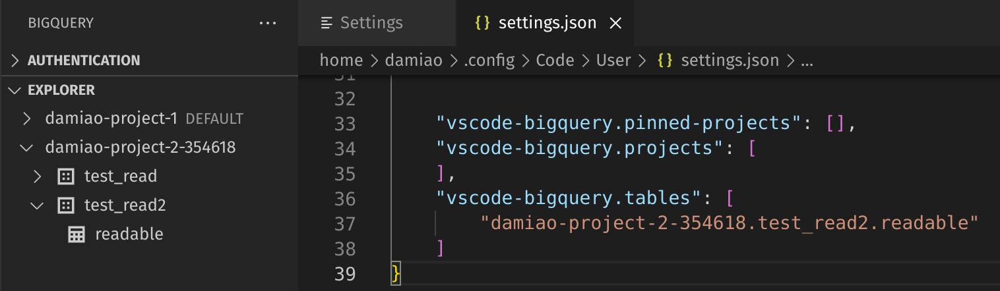

# BigQuery Extension for Visual Studio Code

A full-featured Google BigQuery extension for VS Code. Authenticate with GCP, browse projects/datasets/tables, run queries with live diagnostics, visualize results, use notebooks, and get schema-aware AI assistance — all without leaving your editor.

## Table of Contents

- [Prerequisites](#prerequisites)
- [Authentication](#authentication)
- [Explorer](#explorer)
- [Running Queries](#running-queries)
- [Query Results](#query-results)
- [Notebooks](#notebooks)
- [Language Features](#language-features)
- [Copilot Chat Integration](#copilot-chat-integration)
- [Search](#search)
- [Job History](#job-history)
- [Export & Publish](#export--publish)
- [Settings](#settings)
- [Keyboard Shortcuts](#keyboard-shortcuts)
- [Troubleshooting](#troubleshooting)
- [Contributing](#contributing)

---

## Prerequisites

The [Google Cloud CLI (`gcloud`)](https://cloud.google.com/sdk/docs/install) must be installed. This extension uses `gcloud` for all authentication.

---

## Authentication

Open the **BigQuery** activity bar (side panel) and expand the **Authentication** section. The panel is organized into three groups:



### Authenticated

Lists all `gcloud` accounts currently available on the machine. The active account is marked with **[ACTIVE]**. Inline actions on each account allow you to:

- **Activate** — switch the active `gcloud` account (used for all subsequent BigQuery requests).
- **Remove** — revoke the account credentials.

Once an account is active and has the necessary BigQuery permissions, the extension is ready to use.

### Add authentication

| Option | Description |
|--------|-------------|
| **user login** | Opens the system browser for Google Cloud authentication. Sets up Application Default Credentials so the extension can make BigQuery API calls. |
| **user login plus google drive** | Same browser-based flow, with additional Google Drive scope enabled. Required to query Google Sheets-backed external tables. |
| **user login no browser launch** | For headless or remote SSH sessions where a browser cannot be opened. Runs `gcloud auth login --no-launch-browser` in an integrated terminal and prints a URL that can be copied to a browser on another machine to complete authentication. |
| **service account** | Opens a file picker to select a service account JSON key file. The key is copied to the Application Default Credentials location. |

### Problems authenticating?

| Option | Description |
|--------|-------------|
| **troubleshoot** | Opens a dedicated webview panel with step-by-step guidance for the most common authentication and permission issues (see [Troubleshooting](#troubleshooting)). |
| **gcloud init** | Opens an integrated terminal and runs `gcloud init` to perform a full Google Cloud CLI setup — useful for first-time configuration or resetting the active project and account. |

The authentication panel refreshes automatically when changes are detected, or manually via the command **`BigueryView: Authentication refresh`** or the refresh button in the panel toolbar.

---

## Explorer

The **Explorer** panel displays a hierarchical tree of your GCP resources:

**Projects → Datasets → Tables / Views / Routines / Models**



Key features:
- **Distinct icons** for regular tables, partitioned tables, views, external tables, linked datasets, routines (procedures/UDFs), and ML models.
- **Shard grouping** — tables following the `name_YYYYMMDD` naming pattern are collapsed into a single group.
- **Pagination** — datasets with many tables show a "Load more…" node.
- **Set default project** — choose which project queries run against (inline button on each project).
- **Pin/Unpin projects** — pinned projects are sorted to the top of the list.

### Context menu actions

Right-click tables, views, routines, or models to access:



| Action | Available on | Description |
|--------|-------------|-------------|
| **Create query** | Tables, Models | Opens a new `.bqsql` editor with a template query (`SELECT … FROM` for tables, `ML.PREDICT`/`ML.FORECAST` for models). Partition-aware — adds a `WHERE` clause for time-partitioned tables. |
| **Open DDL** | Tables, Views, Routines, Models | Opens a new `.bqsql` editor with the full `CREATE` statement reconstructed from API metadata — no billable query is run. The table schema is pre-loaded for auto-completion. |
| **Preview** | Tables, Views | Opens a data preview panel. For views and external tables, a `SELECT *` query is run internally. |

### Toolbar buttons

The Explorer panel toolbar provides quick access to:
- **Refresh** — reload the tree.
- **Search** — open the [search panel](#search).
- **Create Notebook** — create a new `.bqnb` notebook.
- **Create Query** — create a new empty `.bqsql` file.

---

## Running Queries

This extension registers the `.bqsql` file extension for BigQuery SQL. Create or open a `.bqsql` file to get started.

| Action | Shortcut | Command |
|--------|----------|---------|
| **Run all queries** in the editor | `Ctrl+Enter` | `BigueryView: Run Query` |
| **Run selected query** (text selection only) | `Ctrl+E` | `BigueryView: Run Selected Query` |

Both actions are also available as buttons in the editor title bar.



Multi-statement scripts are fully supported — child jobs are resolved automatically.

### Live diagnostics

Every change in the editor triggers a [dry-run](https://cloud.google.com/bigquery/docs/dry-run-queries) validation against BigQuery:

- **Errors** are underlined in the editor with descriptive messages. Missing table references are highlighted directly on the table identifier.



- **Bytes estimate** — when the query is valid, the status bar shows the estimated bytes that will be processed.


---

## Query Results

Query results open in a panel with **three tabs**:

### Results

A high-performance data grid powered by a custom Rust/WASM renderer. The grid supports pagination and an integrated find widget.

From the results grid you can:
- **Download CSV** — export all rows to a `.csv` file.
- **Download JSONL** — export all rows as newline-delimited JSON.
- **Send to Pub/Sub** — publish rows to a Google Cloud Pub/Sub topic.

See [Export & Publish](#export--publish) for details on each.

### Visualization

Built-in charting powered by [Chart.js](https://www.chartjs.org/). Available chart types:

- Bar, Line, Scatter, Pie, Doughnut

Select columns for the X and Y axes, then click **Render** to generate the chart. Supports up to 10,000 rows.

### Job Information

Displays the full BigQuery job metadata: job ID, project, location, statement type, bytes processed, timing, configuration, and statistics.

---

## Notebooks

BigQuery Notebooks (`.bqnb` files) provide a cell-based workflow similar to Jupyter, but for BigQuery SQL.

- Each cell uses the `bqsql` language with full syntax highlighting and completions.
- Execute cells individually; results appear inline with the same grid, chart, and job-info tabs as the query results panel.
- Multi-statement scripts are split into separate outputs per child job.
- Export actions (CSV, JSONL, Pub/Sub) are available directly from notebook cell outputs.
- Create a new notebook with the **`BigueryView: Create New Notebook`** command or the toolbar button in the Explorer panel.

---

## Language Features

The following editor features are available in `.bqsql` files:

| Feature | Description |
|---------|-------------|
| **Syntax highlighting** | TextMate grammar with semantic token enhancements for keywords, numbers, strings, operators, identifiers, and comments. |
| **Code completion** | Context-aware suggestions: column names (from live BigQuery schemas), SQL functions, keywords. Dot-trigger (`alias.`) provides columns for the referenced table. Multi-table queries show qualified `alias.column` completions. CTE columns are resolved locally without API calls. |
| **Diagnostics** | Real-time dry-run error highlighting with bytes-processed estimates in the status bar. |
| **Snippets** | Registered for the `bqsql` language. |
| **Bracket matching & folding** | Auto-closing pairs, comment toggling, and code folding. |

---

## Copilot Chat Integration

The extension registers a **`@bigquery`** chat participant for GitHub Copilot Chat, providing schema-aware SQL assistance.

| Command | Description |
|---------|-------------|
| `@bigquery` *(freeform)* | Ask any BigQuery SQL question. The assistant automatically loads schemas for all tables referenced in the active `.bqsql` editor. |
| `@bigquery /explain` | Get a step-by-step plain-English explanation of the current query. |
| `@bigquery /optimize` | Receive cost and performance optimization suggestions (partition pruning, bytes reduction, full-scan avoidance). |
| `@bigquery /schema` | Display a formatted table of all referenced table schemas with column names, types, partition keys, and descriptions. |

---

## Search

**Command:** `BigQuery: Search datasets, tables, columns…`
**Shortcut:** `Ctrl+Shift+F10` (macOS: `Cmd+Shift+F10`)

Opens a search panel powered by the [Dataplex Universal Catalog API](https://cloud.google.com/dataplex/docs/search-for-resources) — no billable BigQuery jobs are used.

- Search across datasets, tables, views, and models.
- Each result shows its kind with a badge and icon.
- Click **Open** to preview a table or **Create Query** to generate a template query.
- Paginated results with a "Load more" button.

> **Note:** The Dataplex API must be enabled on your GCP project. If it is not, the extension will display activation instructions.

---

## Job History

The **Jobs** panel in the activity bar lists recent BigQuery jobs.

- Each job shows its state (success, failed, running), creation time, user, and a query preview.
- **Toggle "My jobs only"** to filter between all project jobs and your own jobs.
- **Load more** to paginate through history (50 jobs per page).
- **Open query** — click a job to open its SQL in a new `.bqsql` editor.
- **Refresh** the list manually via the toolbar button.

---

## Export & Publish

All export actions are available from the results grid (after running a query or previewing a table).

### Download CSV

Exports all result rows to a `.csv` file. Supports multiline cell values. Paginates in batches of 10,000 rows.

### Download JSONL

Exports all result rows as [newline-delimited JSON](https://jsonlines.org/). Includes a progress notification with cancellation support.

### Send to Pub/Sub

Publishes query result rows as messages to a Google Cloud Pub/Sub topic (one message per row). Sends in batches of 1,000 messages with progress tracking and cancellation.

**Requirements:**
- The query must include a column named `data` of type `STRING` or `JSON`.
- Optionally, include a column named `attributes` of type `RECORD` to set message attributes.

```sql
SELECT
    (
    SELECT AS STRUCT
        "my test test" AS test,
        "amazing data type" AS data_type
    ) AS attributes,

    TO_JSON(t) AS data

FROM `dataset.table` t
```


When prompted, enter the full topic name: `projects/<project_id>/topics/<topic_name>`.



> **Warning:** There is no row limit on any export. Large result sets will require significant memory and time.

---

## Settings

Configure the extension via VS Code settings (`Preferences: Open Settings`) or the settings JSON file.



| Setting | Type | Default | Description |
|---------|------|---------|-------------|
| `vscode-bigquery.pinned-projects` | `array` | `[]` | GCP project IDs pinned to the top of the Explorer tree. |
| `vscode-bigquery.projects` | `array` | `[]` | Additional project IDs to list when only dataset-level permissions exist. |
| `vscode-bigquery.tables` | `array` | `[]` | Fully-qualified table IDs (`project.dataset.table`) to list when only table-level permissions exist. |
| `vscode-bigquery.my-jobs-only` | `boolean` | `true` | Show only your own jobs in the Jobs panel. |



### Adding projects without full access

If you only have read permissions at the dataset or table level, the project won't appear automatically. Add the project ID to `vscode-bigquery.projects`, and its datasets will be listed.

### Adding individual tables

When access is granted to specific tables only, add their fully-qualified IDs to `vscode-bigquery.tables`.



---

## Keyboard Shortcuts

| Shortcut | Action |
|----------|--------|
| `Ctrl+Enter` | Run all queries in the active `.bqsql` editor |
| `Ctrl+E` | Run selected query text |
| `Ctrl+Shift+F10` (`Cmd+Shift+F10` on macOS) | Open BigQuery search |

---

## Troubleshooting

Run the command **`BigueryView: troubleshoot`** to open a dedicated panel with guidance for common issues:

- Verifying the Google Cloud CLI is installed and has an active account.
- Listing projects when only dataset- or table-level permissions are available.
- Resolving a Windows-specific credential caching issue (deleting `application_default_credentials.json` from the `gcloud` configuration folder).

If the results panel does not open after running a query for the first time, restart VS Code.

---

## Contributing

- **Project board:** [github.com/orgs/bstruct/projects/1/views/2](https://github.com/orgs/bstruct/projects/1/views/2)
- **Report a bug:** [github.com/bstruct/vscode-bigquery/issues](https://github.com/bstruct/vscode-bigquery/issues)
